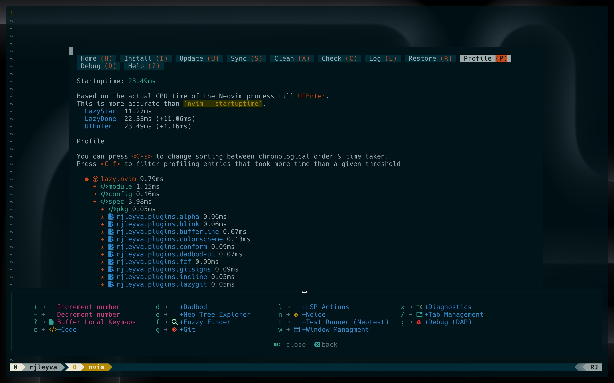
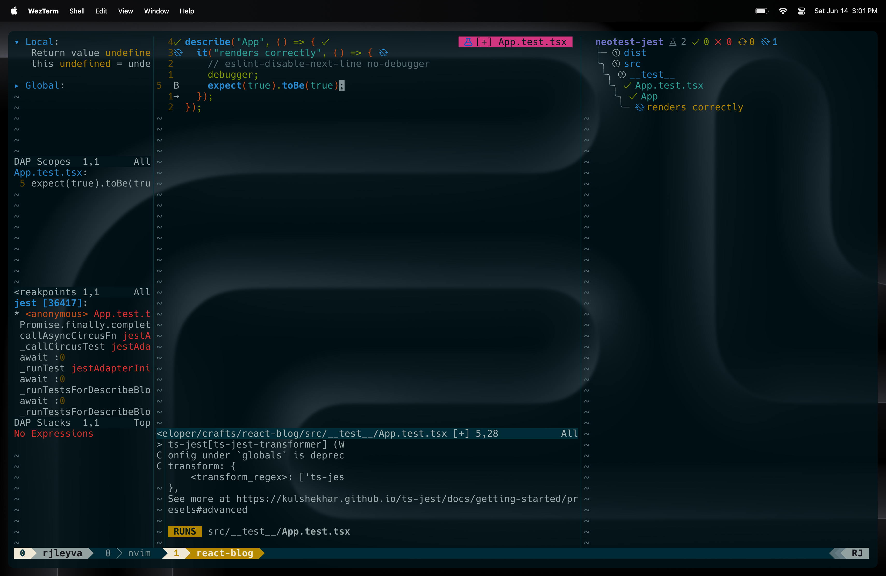

# RJ's dotfiles (Frontend Focus) 🌴

These dotfiles reflect my current development setup, tailored for daily use. I regularly update this repository as I discover new tools or ways to streamline my workflow. While these configurations are optimized for my needs, I hope you’ll find something here that enhances your own setup too.

> **IMPORTANT:** Tools like `prettier`, `stylua`, `selene`, and `eslint_d` are **not auto-installed**.
> You’ll need to manually install them using the :Mason command or by pressing <leader>M — a custom keybinding inspired by Folke’s setup that launches Mason directly from within Neovim.
> This config is optimized for speed, with a cold startup time of under 30ms on a modern machine.

> Measured with lazy.nvim’s built-in profiler.

---

## Requirements & Tools

Here's a list of the tools I use alongside these dotfiles:

- **[WezTerm](https://wezfurlong.org/wezterm/)** – A GPU‑accelerated, cross‑platform terminal emulator and multiplexer written in Rust
- **[Neovim](https://neovim.io/)** – The core extensible Vim-based editor powering this setup
- **[lazy.nvim](https://github.com/folke/lazy.nvim)** – A fast, modern plugin manager for Neovim by folke, used to load and manage all plugins in this configuration.
- **[Nerd Font](https://www.nerdfonts.com/)** – Patches developer fonts with hundreds of extra glyphs/icons (e.g., Font Awesome, Devicons)
- **[solarized-osaka](https://github.com/craftzdog/solarized-osaka.nvim)** – A clean, dark Neovim (and Tmux) theme written in Lua, with LSP and Treesitter support
- **[commitizen](https://github.com/commitizen/cz-cli)** – Helps enforce conventional commit message formatting for a cleaner commit history
- **[eza](https://github.com/eza-community/eza)** – A modern alternative to `ls`, with colorized, Git-aware output in a single fast binary
- **[fd](https://github.com/sharkdp/fd)** – A simple, fast, and user-friendly replacement for `find` with intuitive defaults
- **[bat](https://github.com/sharkdp/bat)** – A `cat` clone (“cat with wings”) featuring syntax highlighting, Git integration, and themes
- **[zoxide](https://github.com/ajeetdsouza/zoxide)** – A smarter `cd` replacement inspired by `z`/`autojump`, tracking and ranking your frequent directories
- **[delta](https://github.com/dandavison/delta)** – A syntax-highlighting pager for `git diff`, grep, and other output formats
- **[ripgrep](https://github.com/BurntSushi/ripgrep)** – A blazing-fast search tool for command-line use and live-grep integration
- **[lazygit](https://github.com/jesseduffield/lazygit)** – A terminal-based Git UI with tight Neovim integration
- **[tldr](https://github.com/tldr-pages/tldr)** – Community-driven simplified man pages for common CLI tools

---

## LSP Support Highlights

These language servers are configured with `nvim-lspconfig` and optimized for web development:

| Language/Tech     | Server        | Features                                                            |
| ----------------- | ------------- | ------------------------------------------------------------------- |
| **HTML**          | `html`        | Hover docs, reference lookup                                        |
| **Astro**         | `astro`       | TS diagnostics, custom root detection, ESLint opt-out               |
| **Svelte**        | `svelte`      | TS diagnostics, custom config, ESLint opt-out                       |
| **TypeScript/JS** | `vtsls`       | Inlay hints, function call completion, project-aware root detection |
| **CSS/SCSS/LESS** | `cssls`       | Linting, validation, warning on unknown `@rules`                    |
| **Tailwind CSS**  | `tailwindcss` | Class linting, conflict detection, custom `classRegex` extraction   |
| **GraphQL**       | `graphql`     | TS integration, `.graphql` support                                  |
| **JSON**          | `jsonls`      | Auto schemas from `schemastore`, validation enabled                 |
| **Emmet**         | `emmet_ls`    | HTML/CSS snippets, BEM support                                      |
| **Lua**           | `lua_ls`      | Strict type checking, Neovim plugin development                     |
| **Go**            | `gopls`       | IntelliSense, diagnostics, formatting, go-to definition             |
| **Python**        | `pyright`     | Type checking, IntelliSense, linting, formatting                    |

Formatting is handled by external tools (like `conform.nvim`) to maintain speed and flexibility.

---

## Development Tooling

This configuration includes tightly integrated tools for HTTP requests, debugging, and test running:

| Tool            | Plugin(s)                      | Description                                                                |
| --------------- | ------------------------------ | -------------------------------------------------------------------------- |
| **REST Client** | [`rest.nvim`]                  | Send HTTP requests from `.http` files, view responses in split or floating |
| **Debugger**    | [`nvim-dap`] + [`nvim-dap-ui`] | JavaScript/TypeScript debugging via `js-debug-adapter`, UI integration     |
| **Test Runner** | [`neotest`] + [`neotest-jest`] | Run tests in Jest, view results inline or in floating output               |

---

## 🪴 Branching Strategy

This repository uses Git branches to track the evolution of my Neovim configuration over time.

### `master`

- The original configuration, designed for a feature-rich and visually enhanced editing experience.
- Includes UI plugins like `lualine.nvim`, `bufferline.nvim`, and `alpha.nvim`.

### `nvim-2025`

- A minimalist and focused configuration introduced in 2025.
- Removes UI-heavy plugins (`lualine.nvim`, `bufferline.nvim`, `alpha.nvim`) to reduce distractions and improve startup performance.
- Introduces new, purposeful tools:
  - [`harpoon2`](https://github.com/ThePrimeagen/harpoon) – for fast file/project navigation
  - [`hardtime.nvim`](https://github.com/m4xshen/hardtime.nvim) – encourages efficient movement usage
  - [`incline.nvim`](https://github.com/b0o/incline.nvim) – lightweight floating statusline per window

This setup is ideal for distraction-free development with speed, simplicity, and focus at its core.

---

## Contributing

Contributions are welcome!

If you spot something that could be improved—whether it’s a typo, a broken config, or a better way to handle a plugin—feel free to open an issue or submit a PR.

No contribution is too small:

- Fix typos or clarify documentation
- Suggest performance or usability improvements
- Recommend new tools or plugins that align with this setup

This is a personal setup, but I’m always open to ideas that make it better for others too.

## Thanks for checking out my dotfiles!

If you find anything here useful, feel free to borrow, adapt, or improve it.
And if you have suggestions or ideas, I’d love to hear them.

Wishing you smooth motions and blazing-fast startups!
