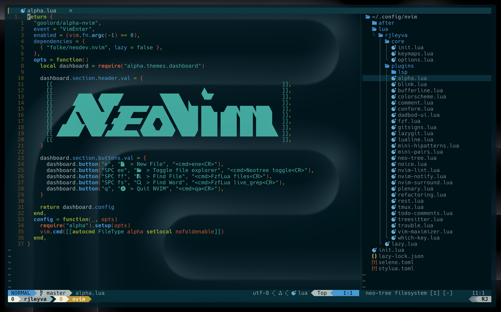

# RJ's dotfiles

These dotfiles reflect my current development setup, tailored for daily use. I regularly update this repository as I discover new tools or ways to streamline my workflow. While these configurations are optimized for my needs, I hope you’ll find something here that enhances your own setup too.

> **Note:** To optimize startup time, tools like `prettier`, `stylua`, `selene`, and `eslint_d` are **not auto-installed**.  
> You need to manually install them via the command `:Mason` inside Neovim.

---

## Neovim Config

Custom configuration built to maximize productivity and code comfort. Features include:

- LSP support with auto-completion
- Treesitter syntax highlighting
- fzf for fuzzy finding
- LazyGit integration
- solarized-osaka theme

---

## Requirements & Tools

Here's a list of the tools I use alongside these dotfiles:

- **[WezTerm](https://wezfurlong.org/wezterm/)** – GPU-accelerated terminal emulator (cross-platform)
- **[eza](https://github.com/eza-community/eza)** – A modern replacement for `ls` with more features
- **[Nerd Font](https://www.nerdfonts.com/)** – Enables icons and ligatures in your terminal (any patched font will work)
- **[Neovim](https://neovim.io/)** – The core of this setup
- **[solarized-osaka](https://github.com/kyoz/palette-osaka)** – My go-to color scheme for both Neovim and Tmux
- **[fd](https://github.com/sharkdp/fd)** – A simple, fast and user-friendly alternative to `find`
- **[bat](https://github.com/sharkdp/bat)** – A `cat` clone with syntax highlighting and Git integration
- **[zoxide](https://github.com/ajeetdsouza/zoxide)** – A smarter `cd` command, inspired by `z` and `autojump`
- **[delta](https://github.com/dandavison/delta)** – A syntax-highlighting pager for Git and diff output
- **[tldr](https://github.com/tldr-pages/tldr)** – Simplified and community-driven man pages
- **[ripgrep](https://github.com/BurntSushi/ripgrep)** – Super fast search tool, used for live grep in Neovim
- **[lazygit](https://github.com/jesseduffield/lazygit)** – A terminal UI for Git, integrated directly into Neovim
- **[commitizen](https://github.com/commitizen/cz-cli)**

---

Feel free to clone, fork, and customize to your heart’s content!
