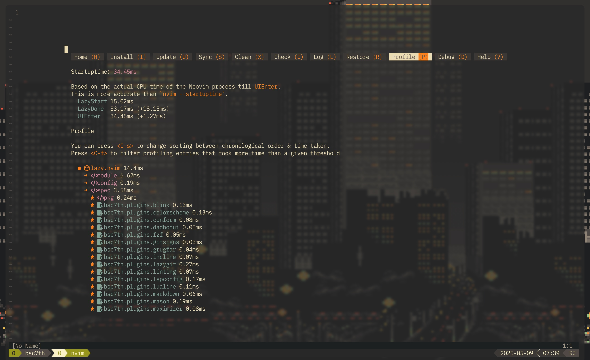
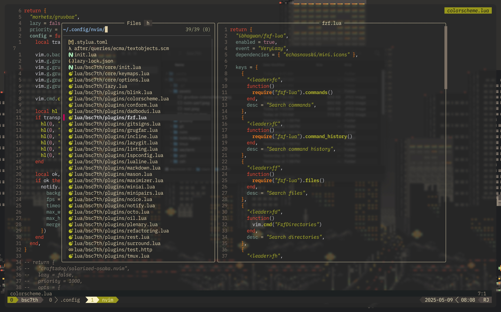
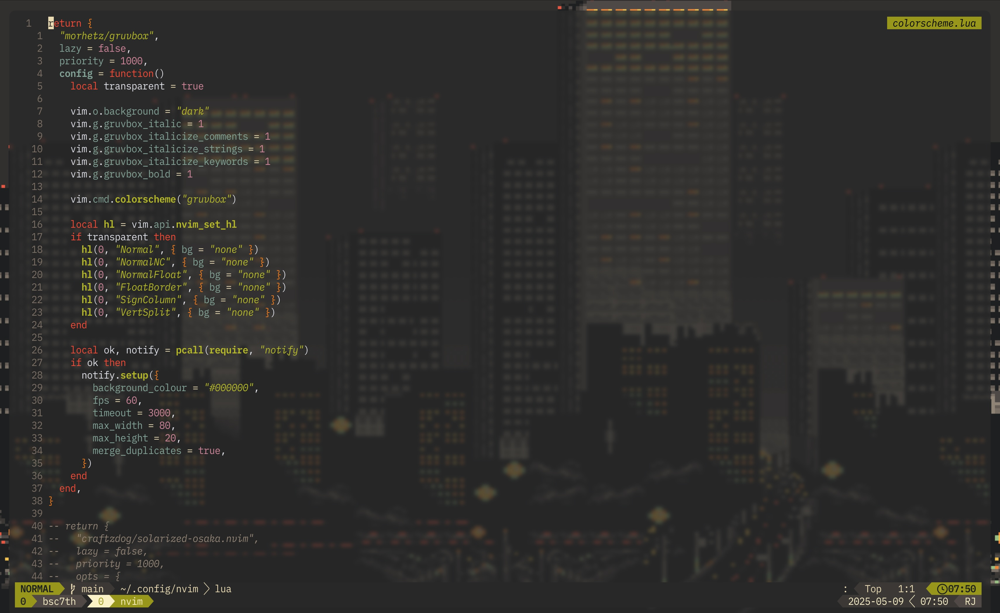
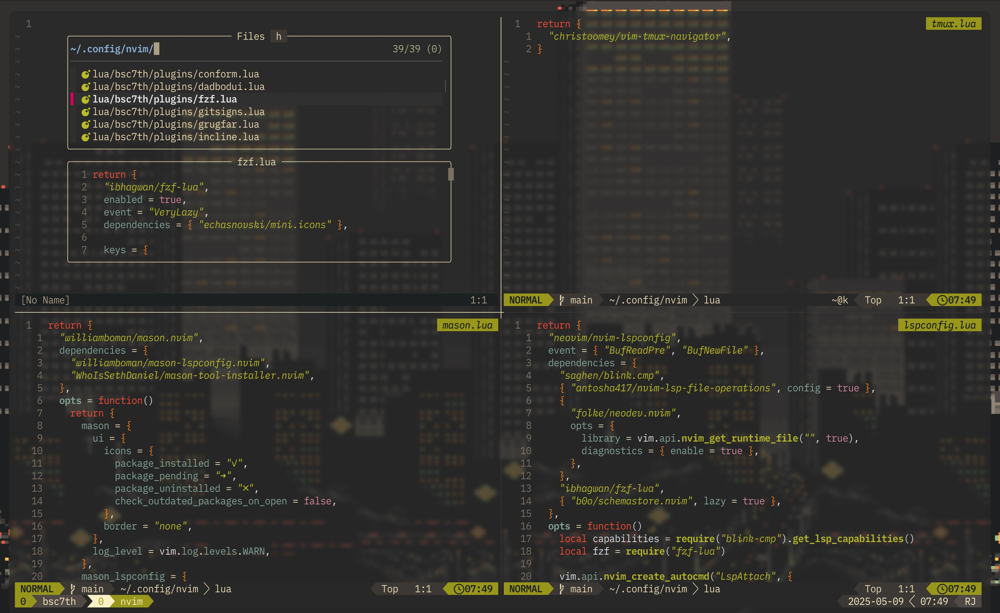
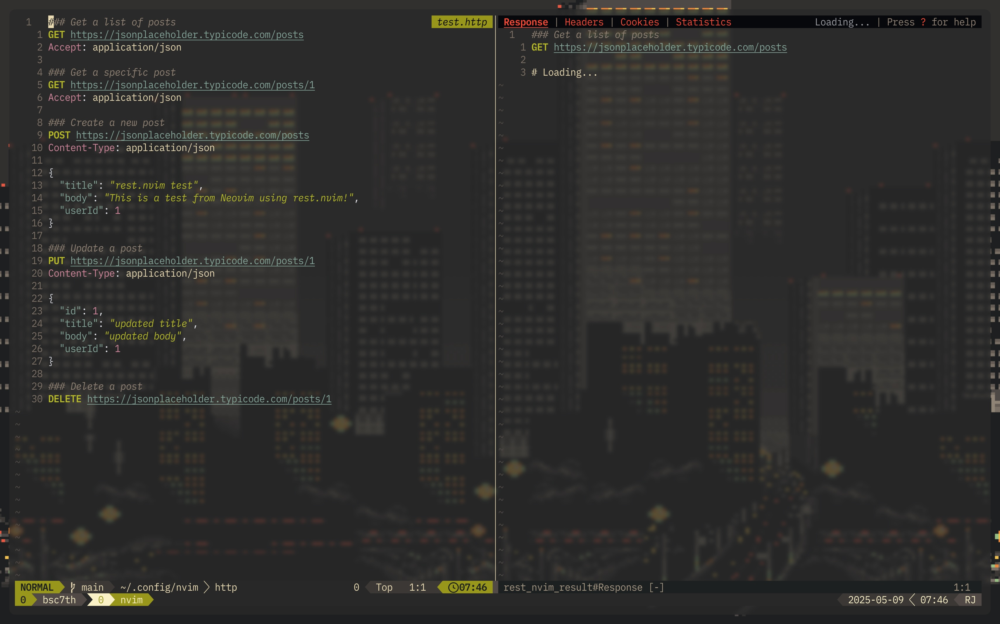

# RJ Leyva's dotfiles

Welcome to my personal dotfiles, the configuration I use daily as I continue my journey in web development. This setup evolves as I learn and discover better tools and workflows.

> ⚠️ **NOTE:** This setup is highly personal and tailored to my specific needs. I don’t recommend copying it directly. Instead, feel free to explore, take inspiration, and adapt it to fit your own preferences and tools. As I grow and learn, I will continue refining and improving this setup to better support my workflow.

## Inspiration

### [Folke](https://github.com/folke)

Many of the plugins I use are inspired by Folke’s incredible work. I started by exploring his [LazyVim](https://www.lazyvim.org/) distro, then gradually customized and adapted it using the [lazy.nvim](https://lazy.folke.io/) plugin manager. His work helped me build a strong foundation for my Neovim setup.

### [Takuya Matsuyama (craftzdog / devaslife)](https://github.com/craftzdog)

### [morhetz](https://github.com/morhetz/gruvbox)

Takuya’s aesthetic and workflow have had a huge influence on me. I use his [solarized-osaka](https://github.com/craftzdog/solarized-osaka.nvim) colorscheme with italics enabled it helps me visually distinguish syntax more easily, which is especially helpful as a beginner.

His approach to coding and note-taking inspired me to adopt [Neovim](https://neovim.io/) as my primary tool for both writing and development, with everything backed up on [GitHub](https://github.com/). I'm also looking forward to subscribing to [Inkdrop](https://www.inkdrop.app/), not just to support Takuya’s work, but because I genuinely believe in the product.

While Solarized Osaka remains my all-time favorite colorscheme, I’ve recently started testing the original **Gruvbox** by [morhetz](https://github.com/morhetz/gruvbox). It brings a warm, vintage vibe that’s equally pleasing and thoughtfully designed, an iconic theme that truly stands the test of time.

### [Josean Martinez](https://github.com/josean-dev)

Josean’s Neovim tutorials on [YouTube](https://www.youtube.com/watch?v=6pAG3BHurdM) played a huge role in shaping my configuration and understanding of [ lazy.nvim ](https://lazy.folke.io/). His videos were the spark that got me into Neovim.
Most of my keymaps and structural choices are based on his setup, though I've made a few changes to accommodate new plugins and avoid conflicts. If you're new to Neovim, I highly recommend watching his [videos](https://www.youtube.com/watch?v=6pAG3BHurdM), they’re clear, beginner-friendly, and incredibly valuable.

### [Mateo Sindičić (JazzyGrim / Sindo)](https://github.com/JazzyGrim/dotfiles/)

I discovered plugins like [`rest.nvim`](https://github.com/rest-nvim/rest.nvim) and [`neotest`](https://github.com/nvim-neotest/neotest) thanks to his [YouTube video](https://www.youtube.com/watch?v=V070Zmvx9AM).  
His content introduced me to the idea of integrating testing into my daily workflow, even for small projects like my blog. I also learned how to send HTTP requests directly from Neovim using `rest.nvim`, which has become a surprisingly useful part of my toolkit.
