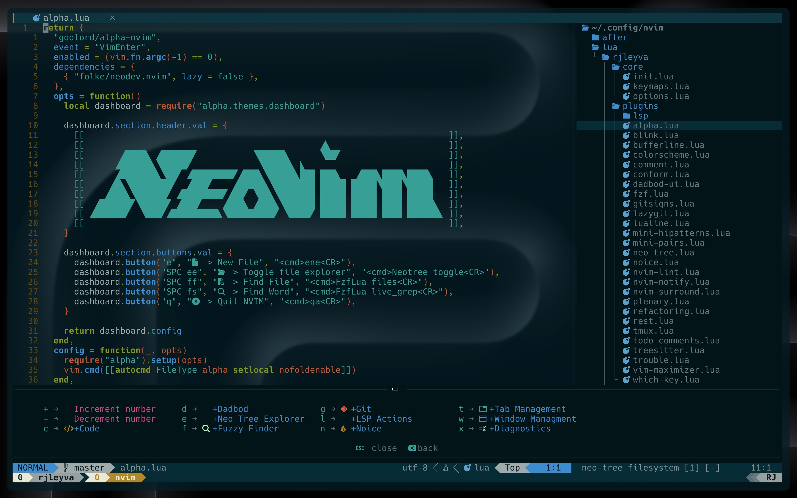

# RJ's dotfiles 🌴

These dotfiles reflect my current development setup, tailored for daily use. I regularly update this repository as I discover new tools or ways to streamline my workflow. While these configurations are optimized for my needs, I hope you’ll find something here that enhances your own setup too.

> **IMPORTANT:** To optimize startup time, tools like `prettier`, `stylua`, `selene`, and `eslint_d` are **not auto-installed**.  
> You need to manually install them via the command `:Mason` inside Neovim.

**Performance Note:** I’m still in the process of optimizing the startup time. Currently, it ranges around 43–46ms, and my goal is to bring it down to under 30 or ideally 20ms.

> **NOTE:** As we all know, [`neodev.lua`](https://github.com/folke/neodev.nvim) has been archived by [folke](https://github.com/folke), but I'm still using it for now as it continues to work well in my setup. That said, I'm gradually transitioning to a more modular and manual LSP configuration as I deepen my understanding of `nvim-lspconfig`, with the goal of improving both maintainability and startup performance.

---

## Requirements & Tools

Here's a list of the tools I use alongside these dotfiles:

- **[WezTerm](https://wezfurlong.org/wezterm/)** – A GPU‑accelerated, cross‑platform terminal emulator and multiplexer written in Rust
- **[Neovim](https://neovim.io/)** – The core extensible Vim-based editor powering this setup
- **[Nerd Font](https://www.nerdfonts.com/)** – Patches developer fonts with hundreds of extra glyphs/icons (e.g., Font Awesome, Devicons)
- **[solarized-osaka](https://github.com/craftzdog/solarized-osaka.nvim)** – A clean, dark Neovim (and Tmux) theme written in Lua, with LSP and Treesitter support
- **[commitizen](https://github.com/commitizen/cz-cli)** – Helps enforce conventional commit message formatting for a cleaner commit history
- **[eza](https://github.com/eza-community/eza)** – A modern alternative to `ls`, with colorized, Git-aware output in a single fast binary
- **[fd](https://github.com/sharkdp/fd)** – A simple, fast, and user-friendly replacement for `find` with intuitive defaults
- **[bat](https://github.com/sharkdp/bat)** – A `cat` clone (“cat with wings”) featuring syntax highlighting, Git integration, and themes
- **[zoxide](https://github.com/ajeetdsouza/zoxide)** – A smarter `cd` replacement inspired by `z`/`autojump`, tracking and ranking your frequent directories
- **[delta](https://github.com/dandavison/delta)** – A syntax-highlighting pager for `git diff`, grep, and other output formats
- **[tldr](https://github.com/tldr-pages/tldr)** – Community-driven simplified man pages for common CLI tools
- **[ripgrep](https://github.com/BurntSushi/ripgrep)** – A blazing-fast search tool for command-line use and live-grep integration
- **[lazygit](https://github.com/jesseduffield/lazygit)** – A terminal-based Git UI with tight Neovim integration

---
